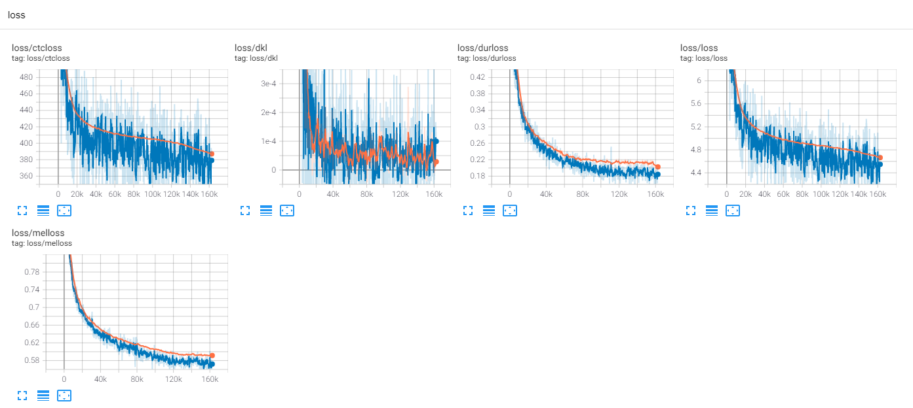

# tf-mlptts

(Experimental) Tensorflow implementation of MLP-Mixer based TTS

## Requirements

Tested in python 3.8.5 windows10 conda environment, [requirements.txt](./requirements.txt)

## Usage

To download LJ-Speech dataset, run under script.

Dataset will be downloaded in '~/tensorflow_datasets' in tfrecord format. If you want to change the download directory, specify `data_dir` parameter of `LJSpeech` initializer.

```python
from speechset.datasets import LJSpeech

# lj = LJSpeech(data_dir=path, download=True)
lj = LJSpeech(download=True) 
```

To train model, run [train.py](./train.py). 

Checkpoint will be written on `TrainConfig.ckpt`, tensorboard summary on `TrainConfig.log`.

```bash
python train.py
tensorboard --logdir .\log
```

If you want to train model from raw audio, specify audio directory and turn on the flag `--from-raw`.

```bash
python .\train.py --data-dir D:\LJSpeech-1.1\wavs --from-raw
```

To start to train from previous checkpoint, `--load-epoch` is available.

```bash
python .\train.py --load-epoch 20 --config D:\tf\ckpt\mlptts.json
```

Pretrained checkpoints are relased on [releases](https://github.com/revsic/tf-mlptts/releases).

To use pretrained model, download files and unzip it. Followings are sample script.

```py
from config import Config
from mlptts import MLPTextToSpeech

with open('mlptts.json') as f:
    config = Config.load(json.load(f))

tts = MLPTextToSpeech(config.model)
tts.restore('./mlptts_299.ckpt-1').expect_partial()
```

## Learning Curve

train LJSpeech 300 epochs with [tf-diffwave](https://github.com/revsic/tf-diffwave)




